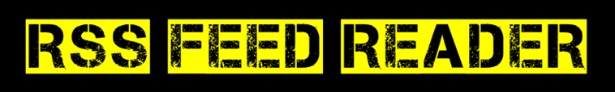

<div align="center">

<br />

[](https://github.com/digi-wolk/rss-feed-reader/actions/workflows/run-tests.yml)
[](https://github.com/digi-wolk/rss-feed-reader/actions/workflows/run-code-quality.yml)
[](https://github.com/digi-wolk/rss-feed-reader/actions/workflows/run-security-checks.yml)

[](https://github.com/digi-wolk/rss-feed-reader/blob/master/LICENSE.md)
[](https://github.com/digi-wolk/rss-feed-reader/commits/master)
[](https://github.com/digi-wolk/rss-feed-reader/graphs/contributors)

</div>

# About
Reads RSS feeds.

# Example usage
Get one RSS feed:
```bash
go run cmd/rssread/rssread.go -rss-feed=https://aws.amazon.com/about-aws/whats-new/recent/feed/
```
Get multiple RSS feeds from a config file:
```bash
go run cmd/rssread/rssread.go -rss-conf=config/rss-feeds.txt
```
Specify how many hours back to look for new items (default is 24 hours)
```bash
go run cmd/rssread/rssread.go -rss-feed=https://aws.amazon.com/about-aws/whats-new/recent/feed/ -hours-back=1
```
Specify to return text or JSON:
```bash
go run cmd/rssread/rssread.go -rss-feed=xxxx -output=text
go run cmd/rssread/rssread.go -rss-feed=xxxx -output=json
```
Verbose logs (suitable for debugging):
```bash
go run cmd/rssread/rssread.go -rss-feed=xxxx -verbose
```
Filter based on one or more keywords:
```bash
# One keyword
go run cmd/rssread/rssread.go -rss-feed=xxxx -filter-words=glue
# Multiple keywords
go run cmd/rssread/rssread.go -rss-feed=xxxx -filter-words=glue,athena
# Case insensitive
go run cmd/rssread/rssread.go -rss-feed=xxxx -filter-words=glue,athena -case-insensitive
```
Exclude based on one or more keywords:
```bash
# One keyword
go run cmd/rssread/rssread.go -rss-feed=xxxx -exclude-words=glue
# Multiple keywords
go run cmd/rssread/rssread.go -rss-feed=xxxx -exclude-words=glue,athena
# Case insensitive
go run cmd/rssread/rssread.go -rss-feed=xxxx -exclude-words=glue,athena -case-insensitive
```
Combine filter and exclude keywords:
```bash
go run cmd/rssread/rssread.go -rss-feed=xxxx -filter-words=athena -exclude-words=glue
```
Comment on Slack:
```bash
# Slack Token should be set as environment variable
export SLACK_API_TOKEN=xxxx
# Slack channel is required if output is set to slack-comment
go run cmd/rssread/rssread.go -rss-feed=https://aws.amazon.com/about-aws/whats-new/recent/feed/ -output=slack-comment -slack-channel=xxx
```
# Check the latest version
You can get the latest version number by:
- Checkin the [CHANGELOG.md](CHANGELOG.md) file
- Running this command:
```bash
git describe --abbrev=0 --tags --match "v*"
```

# Release a new version
You can create a release by tagging the version as follows:
```bash
# Update the version before running the command
RELEASE_VERSION="v1.0.0"
git tag "${RELEASE_VERSION}" -m "Release version ${RELEASE_VERSION}"
git push origin "${RELEASE_VERSION}"
```
The GitHub Action release workflow triggers immediately after the tag is pushed upstream. It will build and publish
the docker image into DockerHub.

# Docker Hub
Docker image is available on [Docker Hub](https://hub.docker.com/r/prazian/rss-feed-reader).

You can pull the latest version by running the following command:
```bash
docker pull prazian/rss-feed-reader:latest
```

You can pull a specific version by running the following command:
```bash
docker pull prazian/rss-feed-reader:v1
```

If you have Docker locally installed, you can run the commands like this:

Read as text in CLI:
```bash
docker run --rm -it \
  prazian/rss-feed-reader:v1 \
  -rss-feed=https://aws.amazon.com/about-aws/whats-new/recent/feed/ \
  -output=text \
  -hours-back=24
```

Comment on an specific Slack channel:
```bash
export SLACK_API_TOKEN=xxx
docker run --rm -it -e GO111MODULE=on \
  prazian/rss-feed-reader:v1 \
  -rss-feed=https://aws.amazon.com/about-aws/whats-new/recent/feed/ \
  -output=slack-comment \
  -slack-channel=xxxx \
  -hours-back=1
```

# Documentation
- [Slack](docs/slack.md)

# Dependency Management
To manage dependencies in this project, you can use the following Makefile targets:

## List all dependencies
To list all dependencies and their versions:
```bash
make list-deps
```

## Update all dependencies
To update all dependencies to their latest versions:
```bash
make update-deps
```

## Update a specific dependency
To update a specific dependency to its latest version:
```bash
make update-pkg PKG=github.com/example/package
```

For example, to update the Slack package:
```bash
make update-pkg PKG=github.com/slack-go/slack
```
